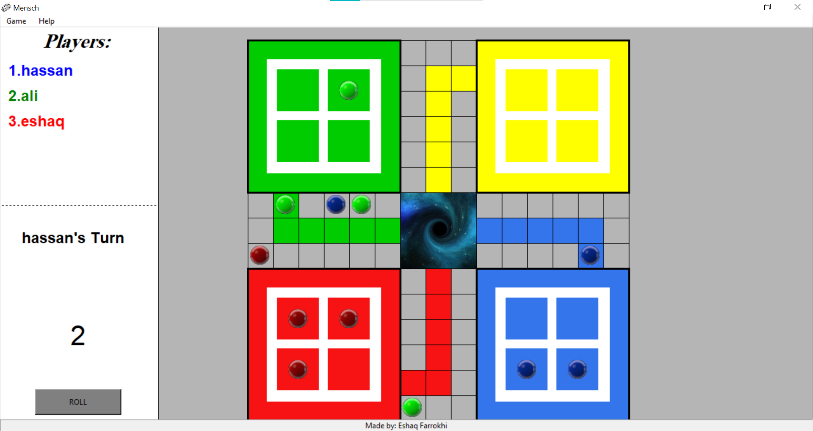
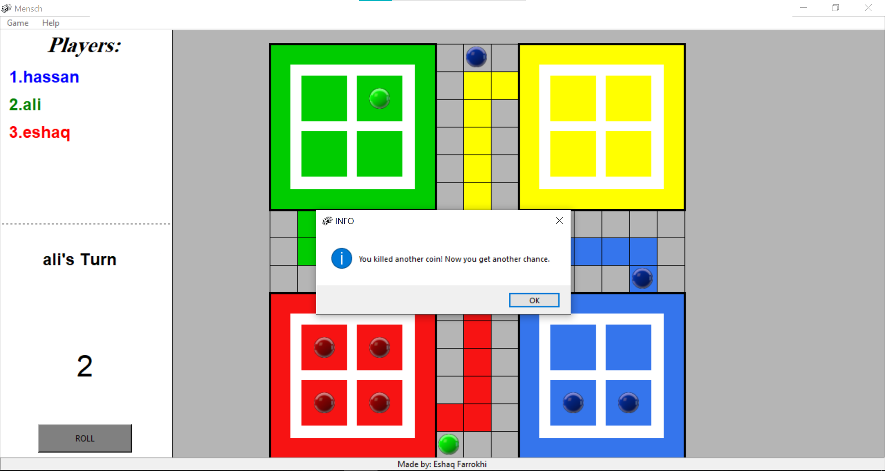
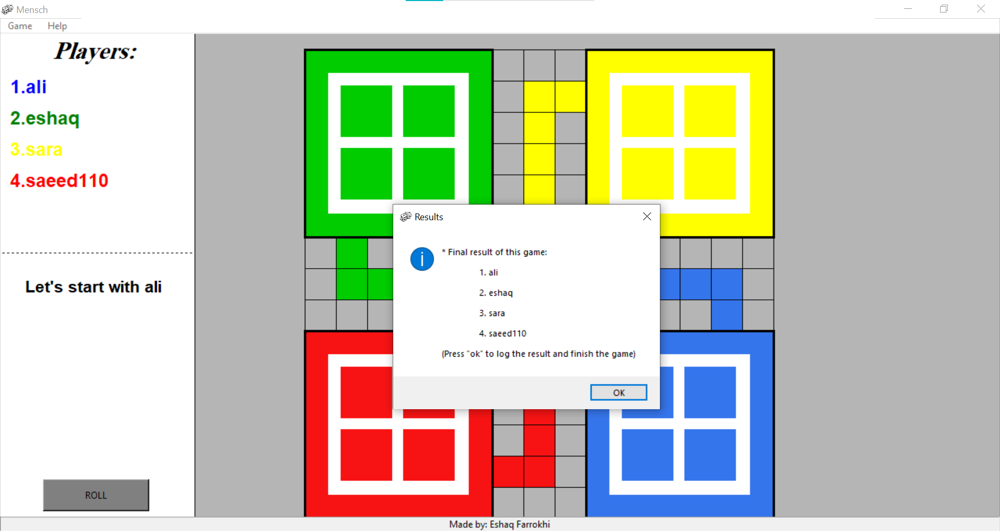

#Mensch :
Mensch is a german game that works with board, pieces and dice.
To play the game you should download the project file include python files and something else.
The game rules was explained in the "How to play ?!" section of the game.This Mensch project use :
- python (programming language)
- Tkinter (as GUI)

#Game pictures:

###Made by :
< Eshaq Farrokhi 11 / 2020 >
